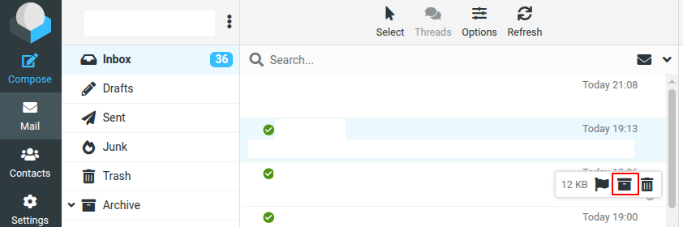

# Archive Hover for Roundcube

Adds an archive button to the message list hover quick-action menu in Roundcube's Elastic skin.



When you hover over a message, an archive icon appears alongside the existing flag and delete buttons. Clicking it archives the message using Roundcube's built-in archive plugin — including subfolder sorting, read-on-archive, and all other archive settings.

The button is automatically hidden when viewing the Archive folder.

## Requirements

- Roundcube 1.6+ with the Elastic skin
- The built-in `archive` plugin must be enabled

## Installation

Copy the `archive_hover` folder into your Roundcube `plugins/` directory, then add it to your `config/config.inc.php`:

```php
$config['plugins'] = [
    // ...
    'archive',
    'archive_hover',
];
```

Make sure `archive_hover` is listed **after** `archive`.

## License

GPL-3.0-or-later
